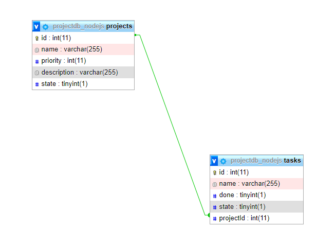

## Nodejs Sequelize RESTAPI MySQL

This is a simple REST API using Javascript Technologies and MySQL.

- nodejs
- express
- MySQL
- sequelize

## Modeling

This is the basic relationship that we are using in this example



## Project Structure

```bash
.
├── package.json
├── requests
│   ├── projects.http
│   └── tasks.http
├── sql
│   └── tasks_nodejs.sql
└── src
    ├── configuration
    │   └── configuration.js
    ├── server
    │   └── server.js
    ├── controllers
    │   ├── project.controller.js
    │   └── task.controller.js
    ├── database
    │   └── connection.js
    ├── index.js
    ├── models
    │   ├── Project.js
    │   └── Task.js
    └── routes
        ├── projects.routes.js
        └── tasks.routes.js
9 directories
```